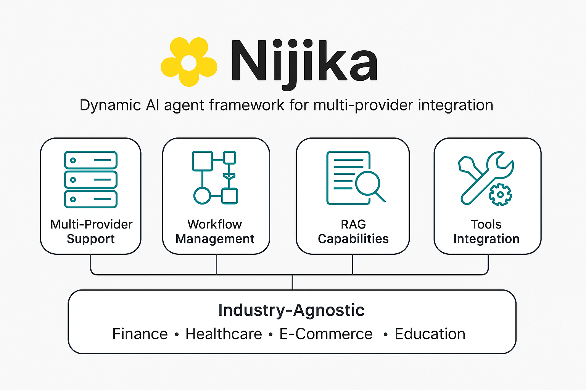

# Nijika AI Agent Framework

A dynamic, industry-agnostic AI agent framework designed for seamless integration across multiple AI providers and models.

## 🚀 Overview

Nijika is a comprehensive Python-based AI agent framework that provides:
- **Multi-Provider Support**: Seamless integration with OpenAI, Anthropic, Google, Azure, and more
- **Workflow Management**: Visual workflow designer and execution engine
- **Tools Integration**: Extensible tool system for various functionalities
- **RAG Capabilities**: Built-in Retrieval-Augmented Generation support
- **Planning & Execution**: Advanced planning algorithms with execution monitoring
- **Industry Agnostic**: Adaptable to finance, healthcare, e-commerce, education, and more

## 🏗️ Architecture

```
nijika/
├── core/                    # Core framework components
│   ├── agent/              # Agent management and lifecycle
│   ├── providers/          # AI provider abstractions
│   ├── memory/             # Memory management system
│   └── config/             # Configuration management
├── workflows/              # Workflow management system
│   ├── engine/             # Workflow execution engine
│   ├── designer/           # Visual workflow designer
│   └── templates/          # Pre-built workflow templates
├── tools/                  # Tool integration system
│   ├── registry/           # Tool registry and discovery
│   ├── builtin/            # Built-in tools
│   └── custom/             # Custom tool development
├── rag/                    # RAG implementation
│   ├── retrievers/         # Document retrieval systems
│   ├── embeddings/         # Embedding management
│   └── storage/            # Vector storage backends
├── planning/               # Planning and reasoning
│   ├── strategies/         # Planning strategies
│   ├── executors/          # Execution engines
│   └── monitors/           # Execution monitoring
├── ui/                     # User interface components
│   ├── dashboard/          # Management dashboard
│   ├── chat/               # Chat interface
│   └── api/                # REST API
└── examples/               # Example implementations
```

## 📦 Key Features

### 1. Multi-Provider AI Integration
- Unified interface for various AI providers
- Dynamic model switching and load balancing
- Cost optimization and rate limiting
- Provider-specific optimizations

### 2. Workflow Management
- Visual drag-and-drop workflow designer
- Conditional logic and branching
- Parallel execution and synchronization
- Workflow templates for common use cases

### 3. Tools & Extensions
- Plugin architecture for custom tools
- Built-in tools for common operations
- Tool composition and chaining
- Security and sandboxing

### 4. RAG System
- Multiple vector database support
- Hybrid search capabilities
- Document chunking and preprocessing
- Context-aware retrieval

### 5. Planning & Execution
- Multi-step planning algorithms
- Self-correcting execution
- Progress monitoring and logging
- Rollback and error handling

## 🚀 Quick Start

```python
from nijika import Agent, WorkflowEngine, RAGSystem

# Create an agent with multiple providers
agent = Agent(
    name="customer_service_agent",
    providers=["openai", "anthropic"],
    tools=["email", "database", "knowledge_base"]
)

# Setup RAG system
rag = RAGSystem(
    documents_path="./knowledge_base",
    embeddings_provider="openai",
    vector_store="faiss"
)

# Create workflow
workflow = WorkflowEngine().create_workflow([
    {"step": "understand_query", "tool": "nlp_processor"},
    {"step": "retrieve_context", "tool": "rag_retriever"},
    {"step": "generate_response", "tool": "llm_generator"},
    {"step": "validate_response", "tool": "quality_checker"}
])

# Execute
result = agent.execute(
    query="How can I return a product?",
    workflow=workflow,
    context=rag.get_context()
)
```

## 🏭 Industry Applications

### Finance
- Fraud detection and risk assessment
- Automated trading strategies
- Customer service and support
- Regulatory compliance monitoring

### Healthcare
- Medical diagnosis assistance
- Patient care coordination
- Drug discovery research
- Clinical trial management

### E-commerce
- Product recommendations
- Customer support automation
- Inventory management
- Price optimization

### Education
- Personalized learning paths
- Automated grading and feedback
- Content generation
- Student support systems

## 🔧 Installation

```bash
pip install nijika
```

## 📚 Documentation

- [Getting Started Guide](docs/getting-started.md)
- [API Reference](docs/api-reference.md)
- [Workflow Designer](docs/workflow-designer.md)
- [Tool Development](docs/tool-development.md)
- [Examples](examples/)

## 🤝 Contributing

We welcome contributions! Please see our [Contributing Guide](CONTRIBUTING.md) for details.

## 📄 License

MIT License - see [LICENSE](LICENSE) file for details. 